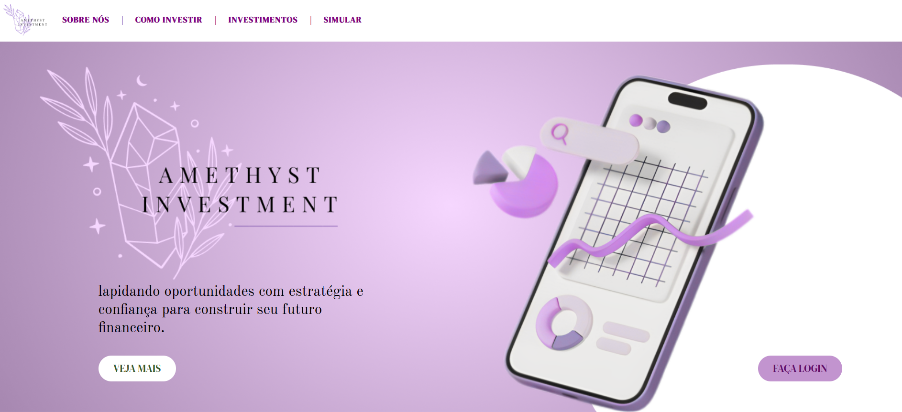

# Projeto-investimentos-2024
Projeto de integração com a matéria "Matemática" da escola (SENAI e SESI) sobre invertimentos.

# Objetivo
Projeto dividido em duplas, no qual o objetivo era a produção de um web site de investimentos. O site tem como intuito mostrar ao cliente qualquer aplicação da capital visando um retorno financeiro futuro.

Eu e minha dupla desenvolvemos o site da "Amethyst Investment" (nome e empresa que supostamente criamos), uma plataforma completa para investimentos. O objetivo era oferecer educação financeira, gestão de portfólios e suporte personalizado, ajudando os clientes a alcançar seus objetivos de forma segura e rentável. O site atraía clientes com serviços transparentes, ferramentas interativas para acompanhamento de investimentos e promovia diversificação e segurança. Além disso, gerava leads e reforçava a marca como confiável e inovadora.

# Observações:
Amethyst Investment é uma empresa fictícia, criada exclusivamente para fins educacionais e como parte do desenvolvimento do projeto do site. Todas as informações, serviços e funcionalidades apresentadas no site foram idealizadas para simular uma plataforma real de investimentos, com o intuito de praticar e demonstrar habilidades de design, desenvolvimento e estratégia digital. 

# Participações e Links

Participação
> [Gabrielly Ribeiro de Lima Sena](https://github.com/GabySena)  

Links
> [Protótipo](https://www.canva.com/design/DAGW6lYi8qY/WUQHsgrmt2V3w_jZ6eBbrQ/edit?utm_content=DAGW6lYi8qY&utm_campaign=designshare&utm_medium=link2&utm_source=sharebutton)  
> [Amethyst Investment]()
